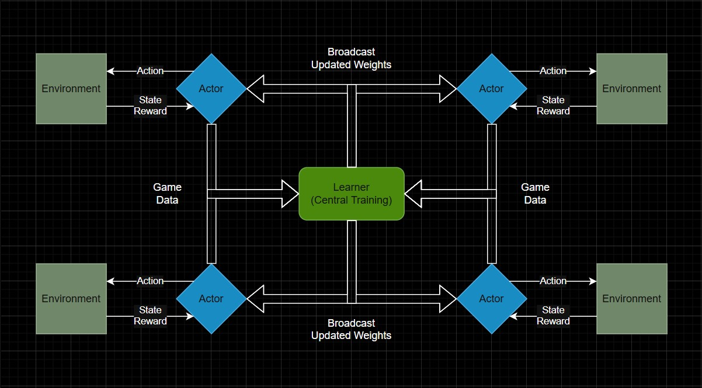

# AlphaZero-AL

高性能 AlphaZero 实现，采用 Actor-Learner 分布式训练架构。集成 C++20 批量 MCTS 引擎、多 GPU DDP 训练、LC0 风格 Moves Left Head (MLH) 以及 PyQt5 图形界面。

基于 [Sunshine-718/AlphaZero](https://github.com/Sunshine-718/AlphaZero)。

## 流水线架构


## 特性

- **C++20 MCTS 引擎 + 游戏环境** &mdash; 基于模板的 OpenMP 并行批量 MCTS 与 bitboard 游戏逻辑，全部通过 pybind11 绑定到 Python
- **分布式 Actor-Learner** &mdash; Flask REST 服务器 + 任意数量的自对弈客户端，支持跨机器部署
- **多 GPU DDP** &mdash; 通过 `torchrun` 进行数据并行训练；单 GPU 时直接 `python server.py` 即可
- **Moves Left Head (MLH)** &mdash; LC0 风格的辅助头，减少已分胜负局面中的无效搜索，支持 warmup 激活
- **双策略头** &mdash; 每个玩家独立的策略头，适应非对称博弈
- **WDL 价值头** &mdash; 3 分类（胜/和/负）价值预测
- **Value Decay & Q-Ratio** &mdash; 游戏长度折扣 + LC0 风格根节点 WDL 混合，提升价值训练质量
- **置换表** &mdash; LRU 缓存神经网络评估结果，加速搜索
- **PyQt5 图形界面** &mdash; 可视化对弈，支持落子动画、胜率显示和预测剩余步数
- **Grad-CAM 可视化** &mdash; 策略头、价值头和步数头的热力图分析

## 安装

### 前置要求

- Python 3.13+
- [PyTorch](https://pytorch.org)（推荐安装 CUDA 版本）
- 支持 C++20 的编译器（MSVC / GCC / Clang）

### 编译

```bash
# 安装依赖并编译 C++ 扩展
# Windows
build.bat

# Linux / macOS
chmod +x build.sh && ./build.sh
```

以上命令会依次执行 `pip install -r requirements.txt` 和 `python setup.py build_ext --inplace`，编译产物：

- `src/cpp/mcts_bindings.cpp` &rarr; `src/mcts_cpp.*.pyd`（或 `.so`）&mdash; MCTS 引擎
- `src/cpp/env_bindings.cpp` &rarr; `src/env_cpp.*.pyd`（或 `.so`）&mdash; 游戏环境（`env_cpp.connect4.Env`）

<details>
<summary>各平台编译参数</summary>

| 平台           | 编译参数                                                                   |
| -------------- | -------------------------------------------------------------------------- |
| MSVC (Windows) | `/std:c++20 /openmp /O2 /utf-8`                                          |
| GCC (Linux)    | `-std=c++20 -fopenmp -O3 -march=native`                                  |
| Clang (macOS)  | `-std=c++20 -Xpreprocessor -fopenmp -O3`（需要 `brew install libomp`） |

</details>

---

## 与 AlphaZero 对弈

### 终端

```bash
python play.py -x              # 执先手（X）
python play.py -o              # 执后手（O）
python play.py -x -n 1000     # 更强的 AI（更多模拟次数）
python play.py --sp            # 观看 AlphaZero 自对弈
```

<details>
<summary>play.py 完整参数</summary>

| 参数                  | 默认值      | 说明                              |
| --------------------- | ----------- | --------------------------------- |
| `-x` / `-o`       | `-x`      | 执先手（X）或后手（O）            |
| `-n`                | `500`     | 每步 MCTS 模拟次数                |
| `-c` / `--c_init` | `4`       | PUCT 探索常数                     |
| `-a` / `--alpha`  | `0.1`     | Dirichlet 噪声 alpha              |
| `--sp`              | 关闭        | 自对弈模式（AI vs AI）            |
| `--model`           | `current` | 权重文件：`current` 或 `best` |
| `--network`         | `CNN`     | 模型架构                          |
| `--env`             | `Connect4`| 游戏环境                          |
| `--name`            | `AZ`      | 模型名称                          |
| `--no_symmetry`     | 关闭        | 禁用搜索中的对称性增强            |
| `--mlh_slope`       | `0.0`     | MLH 斜率（0 = 禁用）              |
| `--mlh_cap`         | `0.2`     | MLH 最大影响上限                  |
| `--mlh_threshold`   | `0.8`     | MLH Q 阈值：\|Q\| < 阈值时抑制 M_utility |

</details>

### 图形界面

```bash
python gui_play.py
```

功能：落子动画、悔棋、可调模拟次数、实时胜率和预测剩余步数显示。

---

## 训练



### 单 GPU

```bash
# 终端 1 - 服务器（Learner）
python server.py --host 0.0.0.0

# 终端 2 - 客户端（Actor）
python client.py --host 127.0.0.1 -B 100
```

### 多 GPU (DDP)

```bash
# 终端 1 - 服务器，使用 2 张 GPU
torchrun --nproc_per_node=2 server.py --host 0.0.0.0

# 终端 2+ - 客户端（可部署在不同机器上）
python client.py --host <服务器IP> -B 100
```

### 训练监控

训练过程通过 [SwanLab](https://github.com/SwanHubX/SwanLab) 记录。追踪指标包括：
策略损失、价值损失、步数损失、熵、梯度范数、F1 分数、Elo 等级分、胜率和对局步数。

<details>
<summary>服务器参数</summary>

| 分组             | 参数                      | 默认值       | 说明                               |
| ---------------- | ------------------------- | ------------ | ---------------------------------- |
| **服务器** | `--host`                | `0.0.0.0`  | 绑定地址                           |
|                  | `--port` / `-P`       | `7718`     | 端口                               |
| **模型**   | `--env`                 | `Connect4` | 游戏环境                           |
|                  | `--model`               | `CNN`      | 架构                               |
|                  | `--name`                | `AZ`       | 实验名称                           |
|                  | `--device` / `-d`     | `cuda`     | 设备                               |
|                  | `--config`              | 关闭         | 显示当前配置并退出                 |
| **MCTS**   | `-n`                    | `100`      | 每步模拟次数                       |
|                  | `-c` / `--c_init`     | `1.4`      | PUCT 探索常数                      |
|                  | `--c_base_factor`       | `5`        | PUCT base = n &times; factor       |
|                  | `--fpu_reduction`       | `0.2`      | 首次探索紧迫度衰减                 |
|                  | `--cache_size`          | `10000`    | LRU 置换表大小                     |
|                  | `--no_symmetry`         | 关闭         | 禁用对称性增强                     |
| **噪声**   | `-a` / `--alpha`      | `0.3`      | Dirichlet alpha                    |
|                  | `--eps`                 | `0.25`     | 噪声混合 epsilon                   |
|                  | `--noise_steps`         | `0`        | Epsilon 衰减步数（0 = 不衰减）     |
|                  | `--noise_eps_min`       | `0.1`      | 最小噪声 epsilon                   |
| **MLH**    | `--mlh_slope`           | `0.1`      | MLH 斜率（0 = 禁用）               |
|                  | `--mlh_cap`             | `0.2`      | MLH 最大影响上限                   |
|                  | `--mlh_threshold`       | `0.0`      | MLH Q 阈值：\|Q\| < 阈值时抑制 M_utility |
|                  | `--mlh_warmup_loss`     | `2.5`      | 步数头损失低于此值时激活 MLH（0 = 从一开始就激活） |
| **自对弈** | `-t` / `--temp`       | `1`        | 温度                               |
|                  | `--temp_decay_moves`    | `12`       | 温度线性衰减步数（0 = 不衰减）     |
|                  | `--temp_endgame`        | `0.3`      | 温度下限（衰减后的最小温度）       |
|                  | `--actor`               | `best`     | 权重来源（`best` / `current`） |
| **训练**   | `--lr`                  | `0.01`     | 学习率                             |
|                  | `-b` / `--batch_size` | `512`      | 批大小                             |
|                  | `--buf`                 | `500000`   | 回放缓冲区容量                     |
|                  | `--q_size`              | `100`      | 开始训练前的最小缓冲区样本数       |
|                  | `--replay_ratio`        | `0.1`      | 缓冲区采样比例                     |
|                  | `--n_epochs`            | `5`        | 每次更新的训练轮数                 |
|                  | `--policy_lr_scale`     | `0.3`      | 策略头学习率倍率                   |
|                  | `--dropout`             | `0.1`      | Dropout 率                         |
|                  | `--q_ratio`             | `0.75`     | 根节点 WDL 与对局结果的混合比例（LC0 风格，0 = 纯 z） |
|                  | `--value_decay`         | `0.99`     | 价值折扣 &gamma;：target = &gamma;^steps &times; z（1.0 = 不折扣） |
| **评估**   | `--interval`            | `10`       | 评估间隔（训练步数）               |
|                  | `--num_eval`            | `50`       | 评估对局数                         |
|                  | `--thres`               | `0.52`     | 更新最优模型的胜率阈值             |
|                  | `--mcts_n`              | `1000`     | 基准测试的纯 MCTS 模拟次数         |

</details>

<details>
<summary>客户端参数</summary>

| 参数                      | 默认值        | 说明                   |
| ------------------------- | ------------- | ---------------------- |
| `--host`                | `127.0.0.1` | 服务器地址             |
| `--port` / `-P`       | `7718`      | 服务器端口             |
| `-d` / `--device`     | `cuda`      | 设备                   |
| `-B` / `--batch_size` | `100`       | 并行自对弈局数         |
| `--cache_size`          | `0`         | 置换表大小（0 = 禁用） |
| `--retry`               | `3`         | 连接失败最大重试次数   |
| `--actor`               | `current`   | 权重来源               |

</details>

---

## 架构

```
AlphaZero-AL/
├── server.py              # 训练服务器（Flask REST + DDP）
├── client.py              # 自对弈客户端（分布式数据采集）
├── play.py                # 终端对弈
├── gui_play.py            # PyQt5 图形界面对弈（赛博朋克 HUD 主题）
├── gui_play_glass.py      # PyQt5 图形界面对弈（玻璃拟态主题）
├── GradCAM.py             # Grad-CAM 热力图可视化
├── setup.py               # C++ 编译脚本
│
├── src/
│   ├── cpp/
│   │   ├── GameContext.h       # MCTSGame concept + ValidMoves<N>
│   │   ├── MCTSNode.h          # 节点结构体（Q, M, prior, noise, UCB）
│   │   ├── MCTS.h              # 单树 MCTS（模拟 + 反向传播 + 节点统计）
│   │   ├── BatchedMCTS.h       # 批量封装（OpenMP 并行）
│   │   ├── Connect4.h          # Connect4 bitboard 游戏逻辑
│   │   ├── mcts_bindings.cpp   # MCTS pybind11 绑定 → mcts_cpp 模块
│   │   ├── env_bindings.cpp    # 环境 pybind11 绑定聚合 → env_cpp 模块
│   │   └── env_connect4.h      # Connect4 Env 绑定（env_cpp.connect4）
│   │
│   ├── environments/
│   │   ├── NetworkBase.py      # 网络基类（训练、保存/加载、LR 调度）
│   │   └── Connect4/
│   │       ├── Network.py      # CNN（ResidualBlock + 双策略头 + WDL + Steps）
│   │       └── utils.py        # 数据增强、棋盘检查
│   │
│   ├── MCTS_cpp.py        # C++ BatchedMCTS 的 Python 封装
│   ├── player.py          # 玩家类（Human, AlphaZero, MCTSPlayer, Batched）
│   ├── pipeline.py        # 训练循环（DDP 广播、评估、日志）
│   ├── game.py            # 自对弈驱动
│   ├── utils.py           # 工具函数（softmax, Elo, RolloutAdapter）
│   ├── ReplayBuffer.py    # 循环回放缓冲区
│   └── Cache.py           # LRU 置换表
│
├── docs/                  # 技术文档（设计报告、调试记录）
├── tools/
│   └── inspect_buffer.py  # 回放缓冲区分析
└── heatmaps/              # Grad-CAM 输出目录
    ├── policy/
    ├── value/
    └── steps/
```

### 神经网络

```
输入 (3 x 6 x 7)
  ├── 通道 0: 玩家 1 棋子
  ├── 通道 1: 玩家 2 棋子
  └── 通道 2: 当前玩家标识
         │
    ┌────┴────┐
    │  主干   │  Stem Conv2d(3→64) + BatchNorm + SiLU
    └────┬────┘
         │
    ┌────┴────┐
    │ 残差块  │  3x ResidualBlock（64 通道, Dropout）
    └────┬────┘
         │
    ┌────┼──────────┬────────────┐
    ▼    ▼          ▼            ▼
  策略   策略     价值         步数
  头 1   头 2     头           头
  (P1)   (P2)  (WDL, 3类)  (0-42, 43类)
```

- **优化器**：SGD（momentum=0.9, weight_decay=1e-4）
- **学习率调度**：LinearLR warmup（100 步, 0.001→1.0）→ LinearLR 衰减（1000 步, 1.0→0.01）
- **梯度裁剪**：max_norm=5

### MCTS UCB 公式

```
UCB = q_value + u_score + m_utility

q_value   = -Q                                                  （父节点视角）
u_score   = C_puct × prior × sqrt(N_parent) / (1 + N_child)    （PUCT 探索项）
m_utility = clamp(slope × (child_M - parent_M), -cap, cap) × Q （MLH 偏好项）
```

---

## 添加新游戏

1. 在 `src/cpp/` 中编写 `NewGame.h`，实现 `MCTSGame` concept（参考 `Connect4.h`）：
   - 定义 `struct Traits { ACTION_SIZE, BOARD_SIZE, BOARD_SHAPE, NUM_SYMMETRIES }`
   - 实现游戏逻辑（`step`、`check_winner`、`is_full`、`get_valid_moves` 等）
2. MCTS 绑定 &mdash; 在 `src/cpp/mcts_bindings.cpp` 中：`#include "NewGame.h"` 并添加 `register_batched_mcts<NewGame>(m, "BatchedMCTS_NewGame")`
3. 环境绑定 &mdash; 编写 `src/cpp/env_newgame.h`（参考 `env_connect4.h`），在 `env_bindings.cpp` 中调用注册函数，暴露为 `env_cpp.newgame.Env`
4. 在 `src/MCTS_cpp.py` 中：添加到 `_BACKENDS` 字典
5. 创建 `src/environments/NewGame/` 目录，包含 `Network.py`、`utils.py`、`__init__.py`（`__init__.py` 中 `from src.env_cpp.newgame import Env`）
6. 重新编译：`python setup.py build_ext --inplace`

---

## 参考文献

- [Silver, D., Schrittwieser, J., Simonyan, K. et al. *Mastering the game of Go without human knowledge.* Nature 550, 354-359 (2017).](https://doi.org/10.1038/nature24270)
- [Silver, D. et al. *A general reinforcement learning algorithm that masters chess, shogi, and Go through self-play.* Science 362, 1140-1144 (2018).](https://doi.org/10.1126/science.aar6404)

## 许可证

[MIT](LICENSE)
