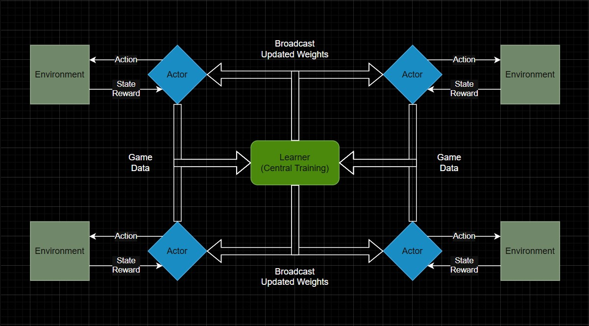

# AlphaZero-AL

高性能 AlphaZero 实现，采用 Actor-Learner 分布式训练架构。集成 C++20 批量 MCTS 引擎、多 GPU DDP 训练、LC0 风格 Moves Left Head (MLH) 以及 PyQt5 图形界面。

基于 [Sunshine-718/AlphaZero](https://github.com/Sunshine-718/AlphaZero)。

## 流水线架构


## 特性

- **C++20 MCTS 引擎 + 游戏环境** &mdash; 基于模板的 OpenMP 并行批量 MCTS 与 bitboard 游戏逻辑，全部通过 pybind11 绑定到 Python；MCTS 当前支持 Connect4 / Othello，环境绑定包含 Connect4 / Othello / Gomoku
- **分布式 Actor-Learner** &mdash; Flask REST 服务器 + 任意数量的自对弈客户端，支持跨机器部署
- **多 GPU DDP** &mdash; 通过 `torchrun` 进行数据并行训练；单 GPU 时直接 `python server.py` 即可
- **辅助 Utility** &mdash; Connect4 使用 LC0 风格 Moves Left Head (MLH)，Othello 支持 KataGo 风格 score utility，并支持 warmup 激活
- **动作策略头** &mdash; Connect4 输出 7 列动作，Othello 输出 64 个落子动作 + pass
- **WDL / Auxiliary / Ownership 头** &mdash; 3 分类价值预测；Connect4 辅助头预测剩余步数，Othello 辅助头预测分差 utility 并带 ownership 监督
- **Value Decay、Root-WDL 蒸馏与 TD 一致性** &mdash; 游戏长度折扣、根节点 WDL 软目标、未来 root-WDL consistency、policy surprise weighting 和熵正则
- **置换表** &mdash; LRU 缓存神经网络评估结果，加速搜索
- **PyQt5 图形界面** &mdash; 可视化对弈，支持落子动画、胜率显示和预测剩余步数

## 安装

### 前置要求

- Python 3.13+
- [PyTorch](https://pytorch.org)（推荐安装 CUDA 版本）
- 支持 C++20 的编译器（MSVC / GCC / Clang）

### 编译

```bash
# 安装依赖并编译 C++ 扩展
# Windows
build.bat

# Linux / macOS
chmod +x build.sh && ./build.sh
```

以上命令会依次执行 `pip install -r requirements.txt` 和 `python setup.py build_ext --inplace`，编译产物：

- `src/cpp/mcts_bindings.cpp` &rarr; `src/mcts_cpp.*.pyd`（或 `.so`）&mdash; MCTS 引擎（Connect4 / Othello）
- `src/cpp/env_bindings.cpp` &rarr; `src/env_cpp.*.pyd`（或 `.so`）&mdash; 游戏环境（`env_cpp.connect4.Env`、`env_cpp.othello.Env`、`env_cpp.gomoku.Env`）

<details>
<summary>各平台编译参数</summary>

| 平台           | 编译参数                                                                   |
| -------------- | -------------------------------------------------------------------------- |
| MSVC (Windows) | `/std:c++20 /openmp /O2 /utf-8`                                          |
| GCC (Linux)    | `-std=c++20 -fopenmp -O3 -march=native`                                  |
| Clang (macOS)  | `-std=c++20 -Xpreprocessor -fopenmp -O3`（需要 `brew install libomp`） |

</details>

---

## 与 AlphaZero 对弈

### 终端

```bash
python play.py -x              # 执先手（X）
python play.py -o              # 执后手（O）
python play.py -x -n 1000     # 更强的 AI（更多模拟次数）
python play.py --sp            # 观看 AlphaZero 自对弈
```

<details>
<summary>play.py 完整参数</summary>

| 参数                  | 默认值      | 说明                              |
| --------------------- | ----------- | --------------------------------- |
| `-x` / `-o`       | `-x`      | 执先手（X）或后手（O）            |
| `-n`                | `500`     | 每步 MCTS 模拟次数                |
| `-c` / `--c_init` | `4`       | PUCT 探索常数                     |
| `-a` / `--alpha`  | `0.1`     | Dirichlet 噪声 alpha              |
| `--sp`              | 关闭        | 自对弈模式（AI vs AI）            |
| `--model`           | `current` | 权重文件：`current` 或 `best` |
| `--network`         | `CNN`     | 模型架构                          |
| `--env`             | `Connect4`| 游戏环境                          |
| `--exp`             | 最新实验  | 实验编号，例如 `001`              |
| `--no_symmetry`     | 关闭        | 禁用搜索中的对称性增强            |
| `--mlh_slope`       | `0.0`     | MLH 斜率（0 = 禁用）              |
| `--mlh_cap`         | `0.2`     | MLH 最大影响上限                  |
| `--score_utility_factor` | `0.0` | Othello 分差 utility 权重         |
| `--score_scale`     | `8.0`     | 分差 atan 映射缩放                |
| `-t` / `--trees`    | `1`       | 根并行 MCTS 树数量                |
| `--vl_batch`        | `1`       | 每棵树的 virtual loss 批大小      |
| `--time_budget`     | 关闭      | 每步时间预算；设置后 `-n` 作为上限 |

</details>

### 图形界面

```bash
python gui_play.py
```

功能：落子动画、悔棋、可调模拟次数、实时胜率和预测剩余步数显示。

---

## 训练



### 单 GPU

```bash
# 终端 1 - 服务器（Learner）
python server.py --host 0.0.0.0

# 终端 2 - 客户端（Actor）
python client.py --host 127.0.0.1 -B 100
```

### 多 GPU (DDP)

```bash
# 终端 1 - 服务器，使用 2 张 GPU
torchrun --nproc_per_node=2 server.py --host 0.0.0.0

# 终端 2+ - 客户端（可部署在不同机器上）
python client.py --host <服务器IP> -B 100
```

### 训练监控

训练过程通过 [SwanLab](https://github.com/SwanHubX/SwanLab) 记录。追踪指标包括：
策略损失、价值损失、步数损失、熵、梯度范数、F1 分数、Elo 等级分、胜率和对局步数。

<details>
<summary>服务器参数</summary>

| 分组             | 参数                      | 默认值       | 说明                               |
| ---------------- | ------------------------- | ------------ | ---------------------------------- |
| **服务器** | `--host` / `-H`          | `0.0.0.0`  | 绑定地址                           |
|                  | `--port` / `-P` / `-p` | `7718`     | 端口                               |
| **模型**   | `--env` / `--environment` | `Connect4` | 游戏环境（训练当前支持 Connect4 / Othello） |
|                  | `--model`               | `CNN`      | 架构                               |
|                  | `--exp`                 | 新实验      | 恢复指定实验编号，例如 `001`       |
|                  | `--device` / `-d`       | `cuda` 可用时为 `cuda`，否则 `cpu` | 设备 |
|                  | `--config`              | 关闭       | 显示当前配置并退出                 |
| **MCTS**   | `-n`                    | `200`      | 每步模拟次数                       |
|                  | `-c` / `--c_init`       | `1.4`      | PUCT 探索常数                      |
|                  | `--c_base_factor`       | `5`        | PUCT base = n &times; factor       |
|                  | `--fpu_reduction`       | `0.2`      | 首次探索紧迫度衰减                 |
|                  | `--vl_batch`            | `4`        | 每棵树的 virtual loss 批大小       |
|                  | `--cache_size`          | `10000`    | LRU 置换表大小                     |
|                  | `--no_symmetry`         | 关闭       | 禁用对称性增强                     |
| **噪声**   | `-a` / `--alpha`        | `0.3`      | Dirichlet alpha                    |
|                  | `--eps`                 | `0.25`     | 噪声混合 epsilon                   |
|                  | `--noise_steps`         | `0`        | Epsilon 衰减步数（0 = 不衰减）     |
|                  | `--noise_eps_min`       | `0.1`      | 最小噪声 epsilon                   |
| **辅助 Utility** | `--mlh_slope`     | `0.1`      | MLH 斜率（0 = 禁用，主要用于 Connect4） |
|                  | `--mlh_cap`             | `0.2`      | MLH 最大影响上限                   |
|                  | `--score_utility_factor` | `0.15`    | 分差 utility 权重（0 = 禁用，主要用于 Othello） |
|                  | `--score_scale`         | `8.0`      | 分差 atan 映射缩放分母             |
|                  | `--mlh_warmup_loss`     | `0`        | 辅助头 loss 阈值；0 = 从一开始激活 |
| **自对弈** | `-t` / `--temp`         | `1`        | 温度                               |
|                  | `--temp_decay_moves`    | `20`       | 开局保持温度的步数（0 = 不切换）   |
|                  | `--temp_endgame`        | `0.0`      | 之后使用的温度                     |
|                  | `--actor`               | `current`  | Actor 权重来源（`best` / `current`） |
| **训练**   | `--lr`                  | `0.001`    | 学习率                             |
|                  | `-b` / `--batch_size`   | `512`      | 批大小                             |
|                  | `--buf` / `--buffer_size` | `500000` | 回放缓冲区容量                     |
|                  | `--q_size`              | `1`        | 开始训练前的最小缓冲区样本数       |
|                  | `--replay_ratio`        | `0.025`    | 缓冲区采样比例                     |
|                  | `--n_epochs`            | `2`        | 每次更新的训练轮数                 |
|                  | `--policy_lr_scale`     | `1`        | 策略头学习率倍率                   |
|                  | `--dropout`             | `0.2`      | Dropout 率                         |
|                  | `--distill_alpha`       | `0.75`     | 根节点 WDL 蒸馏权重                |
|                  | `--distill_temp`        | `2.0`      | 蒸馏温度                           |
|                  | `--value_decay`         | `1`        | 价值折扣 &gamma;（1.0 = 不折扣）   |
|                  | `--psw_beta`            | `0.5`      | Policy Surprise Weighting 强度     |
|                  | `--entropy_lambda`      | `0.05`     | 策略熵正则权重                     |
|                  | `--td_steps`            | `10`       | 未来 root-WDL consistency 的步数   |
|                  | `--td_alpha`            | `0.3`      | TD consistency loss 权重           |
|                  | `--compile`             | 关闭       | 启用 `torch.compile`               |
| **评估**   | `--interval`            | `10`       | 评估间隔（训练步数）               |
|                  | `--num_eval`            | `50`       | 评估对局数                         |
|                  | `--thres`               | `0.65`     | 更新最优模型的胜率阈值             |
|                  | `--mcts_n`              | `1000`     | 基准测试的纯 MCTS 模拟次数         |

</details>

<details>
<summary>客户端参数</summary>

客户端会从服务器同步搜索与自对弈配置；命令行显式传入的参数会覆盖服务器值，并且之后不会被服务器同步覆盖。

| 参数                      | 默认值        | 说明                   |
| ------------------------- | ------------- | ---------------------- |
| `--host` / `-H`           | `127.0.0.1`   | 服务器地址             |
| `--port` / `-P` / `-p`    | `7718`        | 服务器端口             |
| `-d` / `--device`         | `cuda` 可用时为 `cuda`，否则 `cpu` | 设备 |
| `-B` / `--batch_size`     | `100`         | 并行自对弈局数         |
| `--cache_size`            | `0`           | 置换表大小（0 = 禁用） |
| `--retry`                 | `3`           | 连接失败最大重试次数   |
| `--actor`                 | `current`     | 权重来源               |
| `-n`、`-c`、`-a`、`--eps` | 服务器配置    | MCTS 模拟次数、PUCT、Dirichlet 噪声 |
| `--noise_steps`、`--noise_eps_min` | 服务器配置 | 噪声 epsilon 衰减      |
| `--fpu_reduction`、`--vl_batch` | 服务器配置 | FPU 与 virtual loss 批大小 |
| `-t`、`--temp_decay_moves`、`--temp_endgame` | 服务器配置 | 自对弈温度控制 |
| `--mlh_slope`、`--mlh_cap` | 服务器配置 | MLH 参数               |
| `--score_utility_factor`、`--score_scale` | 服务器配置 | Othello score utility 参数 |
| `--value_decay`、`--td_steps` | 服务器配置 | 价值折扣与未来 root-WDL 步数 |
| `--no_symmetry`           | 关闭          | 禁用对称性增强         |
| `--compile`               | 关闭          | 启用 `torch.compile` 推理加速 |
| `--config`                | 关闭          | 显示当前配置并退出     |

</details>

---

## 架构

```
AlphaZero-AL/
├── server.py              # 训练服务器（Flask REST + DDP）
├── client.py              # 自对弈客户端（分布式数据采集）
├── play.py                # 终端对弈
├── gui_play.py            # PyQt5 图形界面对弈（赛博朋克 HUD 主题）
├── gui_play_othello.py    # PyQt5 Othello 图形界面对弈
├── gui_common.py          # GUI 公共组件
├── setup.py               # C++ 编译脚本
│
├── src/
│   ├── cpp/
│   │   ├── GameContext.h       # MCTSGame concept + ValidMoves<N>
│   │   ├── MCTSNode.h          # 节点结构体（WDL, M, ownership, prior, noise）
│   │   ├── MCTS.h              # 单树 MCTS（模拟 + 反向传播 + 节点统计）
│   │   ├── BatchedMCTS.h       # 批量封装（OpenMP 并行）
│   │   ├── Connect4.h          # Connect4 bitboard 游戏逻辑
│   │   ├── Othello.h           # Othello bitboard 游戏逻辑
│   │   ├── Gomoku.h            # Gomoku 环境逻辑（环境绑定）
│   │   ├── RolloutEvaluator.h  # 纯 rollout evaluator
│   │   ├── mcts_bindings.cpp   # MCTS pybind11 绑定 → mcts_cpp 模块
│   │   ├── env_bindings.cpp    # 环境 pybind11 绑定聚合 → env_cpp 模块
│   │   ├── env_connect4.h      # Connect4 Env 绑定（env_cpp.connect4）
│   │   ├── env_othello.h       # Othello Env 绑定（env_cpp.othello）
│   │   └── env_gomoku.h        # Gomoku Env 绑定（env_cpp.gomoku）
│   │
│   ├── environments/
│   │   ├── NetworkBase.py      # 网络基类（训练、保存/加载、LR 调度）
│   │   ├── Connect4/
│   │   │   ├── Network.py      # Connect4 CNN（embedding + residual + attention + policy/WDL/aux）
│   │   │   └── utils.py        # Connect4 数据增强、棋盘检查
│   │   ├── Othello/
│   │   │   ├── Network.py      # Othello CNN（policy/WDL/score/ownership）
│   │   │   └── utils.py        # Othello 数据增强
│   │   └── Gomoku/
│   │       └── __init__.py     # Gomoku 环境入口
│   │
│   ├── MCTS_cpp.py        # C++ BatchedMCTS 的 Python 封装
│   ├── player.py          # 玩家类（Human, AlphaZero, MCTSPlayer, Batched）
│   ├── pipeline.py        # 训练循环（DDP 广播、评估、日志）
│   ├── game.py            # 自对弈驱动
│   ├── utils.py           # 工具函数（softmax, Elo, RolloutAdapter）
│   ├── symmetry.py        # Connect4 / Othello 对称变换
│   ├── ReplayBuffer.py    # 循环回放缓冲区
│   └── Cache.py           # LRU 置换表
│
├── docs/                  # 技术文档（设计报告、调试记录）
├── static/
│   └── dashboard.html     # 训练仪表盘页面
├── tools/
│   ├── inspect_buffer.py  # 回放缓冲区分析
│   └── pretrain_dataset.py # 预训练数据生成
└── params/                # 实验权重与优化器状态
```

### Connect4 神经网络

```
输入 (3 x 6 x 7)
  ├── 通道 0: 玩家 1 棋子
  ├── 通道 1: 玩家 2 棋子
  └── 通道 2: 当前玩家标识
         │
    ┌────┴──────┐
    │ Embedding │  棋子 embedding + 左右镜像轨道 position embedding
    └────┬──────┘
         │
    ┌────┴────┐
    │  主干   │  Conv2d + 3x ResidualBlock + Gated Attention
    └────┬────┘
         │
    ┌────┴──────────┐
    ▼               ▼
  策略头          Dual Head
  (列动作, 7类)   ├── WDL 价值头（draw / win / loss）
                  └── 辅助头（归一化剩余步数）
```

- **优化器**：AdamW（主干/价值/辅助头使用基础学习率，策略头使用 `lr * policy_lr_scale`，embedding 不加 weight decay）
- **学习率调度**：LinearLR warmup（100 步, 0.001→1.0）→ LinearLR 衰减（1000 步, 1.0→0.1）
- **梯度裁剪**：max_norm=5

### MCTS UCB 公式

```
UCB = q_value + u_score + aux_utility

q_value     = -child_Q                                                     （父节点视角）
c_puct      = c_init + log((N_parent + c_base + 1) / c_base)
u_score     = c_puct × effective_prior × sqrt(N_parent) / (1 + N_child)
aux_utility = Game.compute_aux_utility(child_M, parent_M, child_Q, config)

Connect4: aux_utility = clamp(mlh_slope × (child_M - parent_M), -mlh_cap, mlh_cap) × child_Q
Othello:  aux_utility = score_utility_factor × child_score_utility
```

---

## 添加新游戏

1. 在 `src/cpp/` 中编写 `NewGame.h`，实现 `MCTSGame` concept（参考 `Connect4.h`）：
   - 定义 `struct Traits { ACTION_SIZE, BOARD_SIZE, BOARD_SHAPE, NUM_SYMMETRIES }`
   - 实现游戏逻辑（`step`、`check_winner`、`is_full`、`get_valid_moves` 等）
2. MCTS 绑定 &mdash; 在 `src/cpp/mcts_bindings.cpp` 中：`#include "NewGame.h"` 并添加 `register_batched_mcts<NewGame>(m, "BatchedMCTS_NewGame")`
3. 环境绑定 &mdash; 编写 `src/cpp/env_newgame.h`（参考 `env_connect4.h`），在 `env_bindings.cpp` 中调用注册函数，暴露为 `env_cpp.newgame.Env`
4. 在 `src/MCTS_cpp.py` 中：添加到 `_BACKENDS` 字典
5. 创建 `src/environments/NewGame/` 目录，包含 `Network.py`、`utils.py`、`__init__.py`（`__init__.py` 中 `from src.env_cpp.newgame import Env`）
6. 在 `src/pipeline.py` 的环境白名单中加入新游戏名；如需对称增强，也在 `src/symmetry.py` 中添加规则
7. 重新编译：`python setup.py build_ext --inplace`

---

## 参考文献

- [Silver, D., Schrittwieser, J., Simonyan, K. et al. *Mastering the game of Go without human knowledge.* Nature 550, 354-359 (2017).](https://doi.org/10.1038/nature24270)
- [Silver, D. et al. *A general reinforcement learning algorithm that masters chess, shogi, and Go through self-play.* Science 362, 1140-1144 (2018).](https://doi.org/10.1126/science.aar6404)

## 许可证

[MIT](LICENSE)
